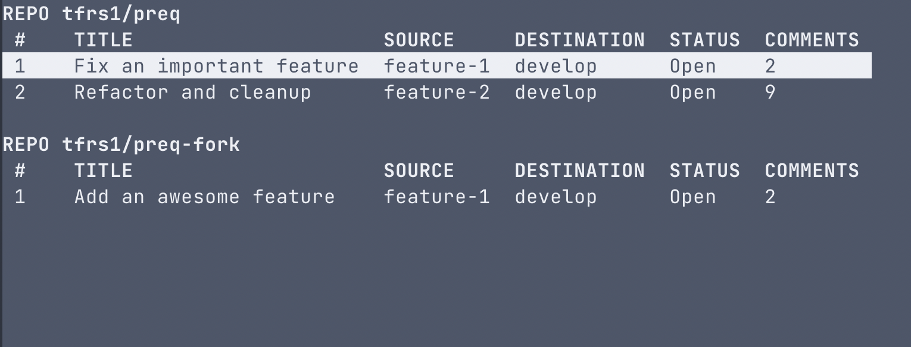

# `preq` - command-line utility for all your pull request needs

<font size="7">ALPHA</font>

`preq` is a command line utility for working with pull requests. It tries to be useful and quick by leveraging information from local Git repositories. Parameters can be also be explicitly set using flags.

The application is in alpha state and only recommended for evaluation.

## Installation

### MacOS using Homebrew

Homebrew tap
```bash
brew install tfrs1/tap/preq
```

### Linux

Linux builds can be found in [releases](https://github.com/tfrs1/preq/releases).

## Usage

`preq` is meant to be used in synthesis with Git. `preq` determines many parameters from the working directory if it is also a Git repository. Of course, all parameters can be explicitly defined if needed.

For example, `preq` can find out the Git origin provider, the repository name, and the source branch for the `create` command.

The following global flags can be used with any `preq` command.
- `--provider`, `-p` - Provider, e.g. `bitbucket`
- `--repository`, `-r` - Repository name, e.g. `owner/repo-name`

### Terminal UI

`preq` is a TUI application as well as a CLI application. To start the TUI you can either run `preq` or `preq -g`, with the latter asking `preq` to display informtion about all known Git repositories. `preq` keeps a history of all local repositories previously seen by `preq`.

> __Note__  
> Currently the only supported provider is Bitbucket cloud.
> - `bitbucket`



### Commands

`preq` currently supports create, decline, approve, open, and list. Run `preq -h` to read more about them.

#### Default reviewers

Default reviewers will be automatically added to the pull requests created with `preq`. Since the program is not able to determine the UUID of your user, the PR creation request will fail if your user is one of the default reviewers. To fix this you need to add the UUID of your user to the configuration.

```toml
[bitbucket]
  username = "username"
  password = "user_password"
  uuid = "{universally-unique-identifier}"
```

Default reviewers will be automatically added to the pull requests created with `preq`.

## Configuration

`preq` reads the configuration from 2 places. From global `~/.config/preq/config.toml`, and from `.preqcfg` if it is found in the working directory.

### Example config
```toml
[bitbucket]
  username = "bitbucket-username"
  password = "secret-password"
  aliases = [
    "bitbucket.org-work",
    "bitbucket.org-personal"
  ]
```
### Bitbucket cloud
To use Bitbucket cloud you must create an app password from the personal settings page with pull request read/write permissions.

* `aliases` - A list of hostname aliases for Bitbucket service. For example when using multiple accounts with different SSH keys.

## Future additions

- Add other providers (GitHub, GitLab, etc.)
- etc.

## Contributing

Contributions are welcome.

### Building from source

Clone the repository and run the build command.
```
go build
```
